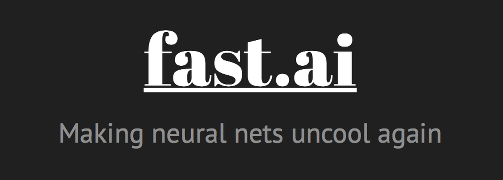

<h1 align="center">

  

  <b><i>はじめまして "Tanaanan " です。 OwO</i> 
  <b><i>PS. you can call me "M" as well. UwU </i></b>
  

  
  
</h1>

  <em>
    An indie <b>Highschooler</b> in <b>Sci-Math</b> class  
    <b>Who like spending freetime self study programming more than learning in school,</b> 
    loved to develop something useful / fun, 
     I devoted my life and time to the joy of learning 
     <b>Work hard, Play hard!</b> 
  </em>

___________

  
🖥️ Learning Algorithm and ML
  
🔭 currently working on main project & side project
  
🌱 Fell behind in maths but I'm trying to catch up 
  

___________

  <i><b>Languages Currently Learning:</b></i>
    
  &nbsp;
  &nbsp;
  &nbsp;
  &nbsp;

  <i><b>Main Libs:</b></i>
    
  &nbsp;
  &nbsp;
  &nbsp;
  &nbsp;
  &nbsp;

<h3 align="center">Education</h3>
<table align="center">
  <tr>
    <td>High school</td>
    <td>Saengthong Vittaya School <b>(MEP - Mini English Program)</b></td>
  </tr>
  <tr>
    <td>Senior high school</td>
    <td>Saengthong Vittaya School  <b>(PCE - Pre Computer Engineer)</b></td>
  </tr>
<table>

  
  
  
   

## 📈 GitHub Stats

  
  

  
  
  
  
   

